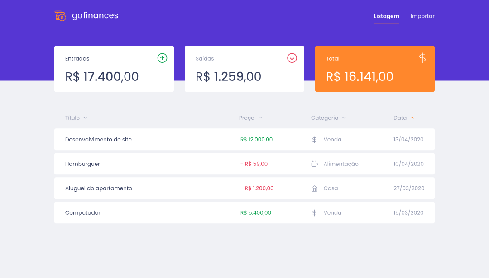

<h3 align="center">
Bootcamp Gostack Challenge 07
</h3>

<h4 align="center">
GoFinances Web
</h4>

<p align="center">
  <a href="README.md">Português</a> |
  <a href="README.en.md">English</a>
</p>

---


<details open="open">
  <summary>Índice</summary>
  <ol>
    <li>
      <a href="#introduction">Introduction</a>
    </li>
    <li>
      <a href="#about-the-project">About the project</a>
    </li>
    <li>
      <a href="#about-the-challenge">About the challenge</a>
    </li>
    <li>
      <a href="#delivery">Delivery</a>
    </li>
    <li>
      <a href="#application-layout">Application layout</a>
    </li>
    <li>
      <a href="#prerequisites">Prerequisites</a>
    </li>
    <li>
      <a href="#installation">Installation</a>
    </li>
    <li>
      <a href="#tests">Tests</a>
    </li>
    <li>
      <a href="#more-information">More information</a>
    </li>
  </ol>
</details>

## Introduction

The seventh challenge for training [React.js] with [Typescript]. Continuation of the development of the application **GoFinances** using routes en file upload using HTML form. Part of [Rocketseat] GoStack Bootcamp training program.

## About the project



This is a **front end** web application that will connect to the **back end** from [Challenge 06: Database and upload file upload in Node.js] to show created transactions allowing to import a CSV file to generate new database records.

## About the challenge

The challenge consists of cloning the template available in [bootcamp-gostack-desafios/desafio-fundamentos-reactjs], installing the required dependencies, opening the files from `src` folder, and complete the places where there's no code, with the code to achieve the goals of each route.

## Delivery

All the goals and unit tests required to deliver the challenge are listed in the [Application Features] and [Tests Specification] sections of the challenge.

## Application layout

The application layout can be accessed on Figma in the [folowing link](https://www.figma.com/file/EgOhyj1Inz14dhWGVhRlhr/GoFinances?node-id=1%3A863).


## Prerequisites

Clone and execute the back end application created on [Challenge 06: Database and upload file upload in Node.js].

1. Clone the API repo

    ```bash
    https://github.com/fernmach/gostack-template-typeorm-upload.git
    ```

2. Install dependencies

    ```bash
    yarn
    ```

3. Start the back end

    ```bash
    yarn dev
    ```

## Installation

1. Clone the repo

    ```bash
    https://github.com/fernmach/desafio-fundamentos-reactjs.git
    ```

2. Install dependencies

    ```bash
    yarn
    ```

3. Start the app

    ```bash
    yarn start
    ```

## Tests

```bash
yarn test
```

## More Information

- [Rocketseat]
- [Challenge details](https://github.com/rocketseat-education/bootcamp-gostack-desafios/tree/master/desafio-fundamentos-reactjs)
- [All Rocketseat bootcamp challenges](https://github.com/rocketseat-education/bootcamp-gostack-desafios/blob/master/README.en.md)

[Rocketseat]: https://rocketseat.com.br/

[Application Features]: https://github.com/rocketseat-education/bootcamp-gostack-desafios/tree/master/desafio-fundamentos-reactjs#funcionalidades-da-aplica%C3%A7%C3%A3o

[Tests Specification]:https://github.com/rocketseat-education/bootcamp-gostack-desafios/tree/master/desafio-fundamentos-reactjs#espec%C3%ADfica%C3%A7%C3%A3o-dos-testes

[bootcamp-gostack-desafios/desafio-fundamentos-reactjs]: https://github.com/rocketseat-education/bootcamp-gostack-desafios/tree/master/desafio-fundamentos-reactjs

[Typescript]: https://www.typescriptlang.org/

[React.js]: https://reactjs.org/

[Challenge 06: Database and upload file upload in Node.js]: https://github.com/fernmach/gostack-template-typeorm-upload/blob/master/README.en.md
